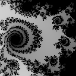

[Programação Paralela](https://github.com/AndreaInfUFSM/elc139-2021a) > Trabalhos

# T6: Geração de Fractais de Mandelbrot com MPI


## Introdução


Neste trabalho, você vai paralelizar um programa que gera uma sequência de imagens representando um "zoom" em um [fractal de Mandelbrot](https://en.wikipedia.org/wiki/Mandelbrot_set). A imagem ao lado foi gerada com esse programa.




## Preparação

1. Descompacte o arquivo [fractal.zip](fractal.zip), que contém o programa sequencial de referência para este trabalho. Este programa foi desenvolvido pelo professor Martin Burtscher, da Texas State University (EUA).

2. Compile o programa:
   ```
   cd fractal
   g++ fractal.cpp -o fractal
   ```

3. Execute o programa para imagens de diferentes tamanhos e diferentes quantidades de frames:
   ```
   ./fractal 512 32
   ./fractal 512 64
   ./fractal 1024 32
   ./fractal 1024 64
   ```

4. Note que o programa **só grava imagens em arquivo para imagens pequenas (<= 256) e poucos frames (<= 100)**. É recomendável gerar algumas imagens quando estiver testando seu programa paralelo, para verificar se estão sendo geradas corretamente. Caso você deseje gerar uma animação, pode usar, por exemplo, o seguinte comando do [ImageMagick](http://www.imagemagick.org):
   ```
   convert -delay 1x10 fractal1*.bmp fractal.gif
   ```


## Desenvolvimento


1. Este trabalho pode ser feito **em dupla ou individualmente**. Para trabalhos em dupla, as execuções devem ser realizadas em mais de um computador.

2. Observe como os parâmetros de entrada influenciam no tempo de execução do programa.

3. Analise o código e identifique oportunidades de paralelismo, considerando que a arquitetura paralela alvo seja um cluster.

4. Projete uma solução paralela para o problema e implemente um programa usando MPI. Use o modelo SPMD (Single Program Multiple Data) e coloque seu programa num arquivo nomeado `fractalpar.cpp`.

5. Analise o desempenho do programa, começando pela medição dos tempos de execução sequencial e paralela para diferentes entradas do programa: a) 1024 32, b) 1024 64 e c) à sua escolha. Varie o número de threads: 2, 4 e 8. Calcule speedup e eficiência para cada caso.  

6. Elabore slides descrevendo a estratégia de paralelização adotada, o ambiente de experimentação (dados da(s) máquina(s) usada(s)), os experimentos realizados, os resultados obtidos (tabelas e gráficos com speedup e eficiência apresentados separadamente) e as conclusões sobre o trabalho.

7. Agora aproveite o programa paralelizado e gere uma animação personalizada. Você pode alterar, por exemplo, a região (coordenadas) do fractal, as cores, o tamanho da imagem e o número de frames.

## Entrega

No repositório de entrega, crie um documento `Entrega.md`, contendo:
 - Identificação completa da disciplina e do aluno;
 - Link para o código desenvolvido: `fractalpar.cpp`;
 - Link para **slides** elaborados;
 - Link para a animação personalizada;
 - Referências.


## Material de apoio


- [Message Passing Interface (MPI)](https://computing.llnl.gov/tutorials/mpi/)  
  Tutorial do Lawrence Livermore National Laboratory (LLNL) sobre MPI.
